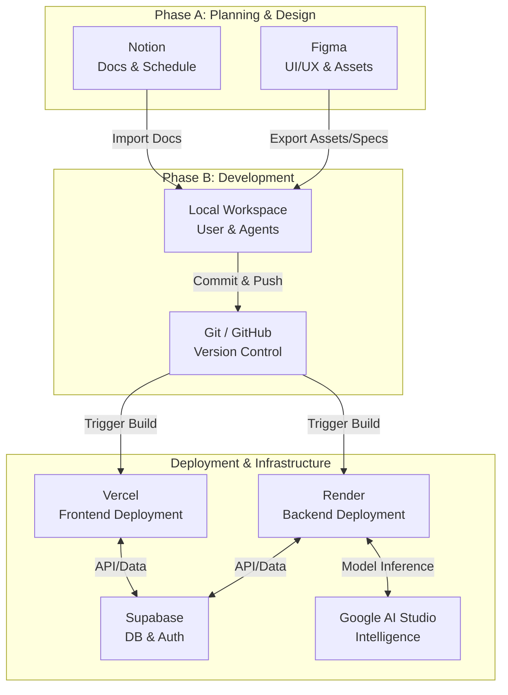

<!-- docs/workflow_tools.md -->
# 프로젝트 도구 및 워크플로우 (Workflow Tools & Connections)

본 문서는 프로젝트에서 사용되는 주요 도구들의 역할과 이들 간의 유기적인 연결 관계(Workflow)를 정의합니다.

## 1. 도구 관계도 (Tool Chain Diagram)

---

## 2. 상세 도구 연결 및 활용 (Detailed Connections)

### 2.1기획 및 디자인 (Planning & Design)

#### 📘 Notion (Documentation Hub)
*   **역할**: 프로젝트의 Single Source of Truth. 모든 기획서, 회의록, 투두 리스트가 작성됩니다.
*   **연결 방식 (Connection)**:
    *   **작성**: PM(User) 및 PM Agent가 Notion에서 문서를 작성합니다.
    *   **동기화**: 작성된 문서는 Markdown 등으로 변환되거나 내용을 복사하여 로컬 프로젝트의 `/docs` 폴더로 가져옵니다 (`Import`).
            **To 노션**: 가져온 파일은 개발자가 직접 복사해서 노션으로 옮깁니다.    
    *   **목적**: 기획 이력 관리 및 공유.

#### 🎨 Figma (Design System)
*   **역할**: 시각적 설계 및 UI 자산 관리.
*   **연결 방식 (Connection)**:
    *   **설계**: User Flow, Wireframe, High-Fidelity Design 작업.
    *   **설정 (Configuration)**:
        *   발급받은 API Key는 프로젝트 루트의 `.env.local` 파일에 `FIGMA_ACCESS_TOKEN`으로 저장하여 보안을 유지합니다.
    *   **핸드오프**: CSS 속성(Token), 이미지(SVG/WebP) 등을 추출하여 개발 환경으로 전달합니다.
    *   **목적**: 개발자와 디자이너 간의 정확한 스펙 전달.

---

### 2.2 개발 및 배포 (Development & Deployment)

#### 💻 Local Workspace & Git
*   **역할**: 실제 코드 작성 및 버전 관리.
*   **연결 방식**:
    *   VS Code 환경에서 작업 후 `git commit`, `git push`를 통해 GitHub 원격 저장소로 코드를 전송합니다.

#### 🚀 Vercel (Frontend)
*   **역할**: Next.js 애플리케이션의 빌드 및 배포, CDN 서빙.
*   **연결 방식**:
    *   GitHub `main` 브랜치에 푸시가 발생하면 자동으로 빌드 및 배포가 트리거됩니다 (CI/CD).
*   **환경 변수**: Supabase URL, API Key 등을 안전하게 관리.

#### ☁️ Render (Backend)
*   **역할**: Node.js 백엔드 서버 호스팅.
*   **연결 방식**:
    *   GitHub 저장소와 연동되어 코드 변경 시 자동 재배포.
    *   Docker 컨테이너 기반으로 환경 일관성 유지.

#### 🗄️ Supabase (Backend as a Service)
*   **역할**: 관계형 데이터베이스(PostgreSQL), 사용자 인증(Auth), 파일 스토리지.
*   **연결 방식**:
    *   Frontend/Backend에서 SDK를 통해 데이터 읽기/쓰기 수행.
    *   프로젝트 초기 단계에서 스키마 정의 및 마이그레이션 관리.

#### 🧠 Google AI Studio (Intelligence)
*   **역할**: 서비스 내 AI 기능(추천, 요약, 생성 등) 구현을 위한 모델 제공.
*   **연결 방식**:
    *   Backend에서 API를 호출하여 Gemini 모델과 통신.
    *   Prompt Engineering 및 파인튜닝 테스트.
